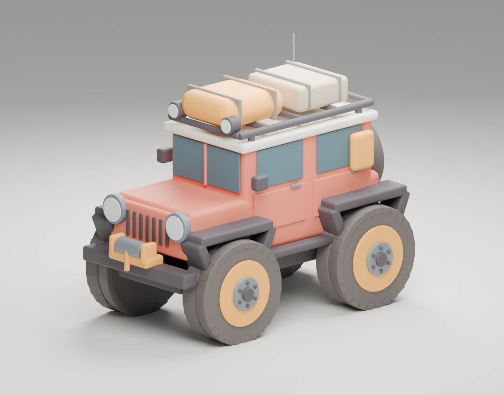

# Catálogo del estudio BlackMamba 3D

Este directorio reúne los modelos del estudio; `apps/` contiene las experiencias que los utilizan. La biblioteca Python `defect3d/` conserva su estructura.

| Proyecto | Fuente editable | Exportación / vista | Estado |
| --- | --- | --- | --- |
| F-18 | [Blender](f18/F18_continuado.blend) | [GLB](f18/F18_continuado.glb), [render](f18/F18_preview.png) | Modelo continuado con reportes de validación |
| F-18 rosa | [Blender](f18/F18_rosa_serigrafiado.blend) | [Render](f18/F18_rosa_serigrafiado.png), GLB de juego en `apps/pink-flight/public/models/` | Serigrafía editable |
| Expedition Rover | [Blender](expedition-rover/Expedition_Rover.blend) | [GLB](expedition-rover/Expedition_Rover.glb), [render](expedition-rover/Expedition_Rover.png) | Primera base; pendiente refinar formas, desgaste y calcomanías |
| Turquoise Microcar | [Blender](turquoise-microcar/Turquoise_Microcar.blend) | [GLB](turquoise-microcar/Turquoise_Microcar.glb), [render](turquoise-microcar/Turquoise_Microcar.png) | Carrocería curva, interior, vidrio transmisivo, emisión y bloom |
| Pink Flight | [Aplicación y documentación](../apps/pink-flight/README.md) | Three.js / Vite | Prototipo de vuelo y editor de parámetros |



## Estructura

- `f18/`: modelos, imágenes de proceso, datos paramétricos y reportes históricos. Los scripts `verify_f18.py` y `verify_pink.py` comprueban geometría y preservación de la versión original.
- `expedition-rover/`: modelo, exportación, render y generador `build_rover.py`.
- `turquoise-microcar/`: microauto turquesa detallado, generador, render y materiales ópticos; [documentación](turquoise-microcar/README.md).
- `../apps/pink-flight/`: aplicación, pruebas y exportador del avión para el juego.

## Blender

Desde la raíz del repositorio, con Blender disponible en el PATH:

```sh
blender --background --python projects/expedition-rover/build_rover.py
blender --background projects/f18/F18_continuado.blend --python projects/f18/verify_f18.py
blender --background --python projects/f18/verify_pink.py
blender --background --python apps/pink-flight/export_aircraft.py
```

El generador del Rover reconstruye sus archivos en su propio directorio. El exportador de Pink Flight utiliza el Blender rosa del catálogo. `validation.json` y `pink_validation.json` se actualizaron al importar. El F-18 base pasa su verificación; la versión rosa abre y tiene geometría finita y 66 elementos de serigrafía, pero 13 objetos originales difieren en geometría o transformación respecto al modelo base actual. `verify_pink.py` registra los nombres y falla la comprobación de preservación. No se modificaron los modelos para ocultar esa diferencia. Estos controles no representan una validación de la biblioteca completa.

## Pink Flight

```sh
cd apps/pink-flight
npm ci
npm test
npm run build
npm run dev
```

Se versionan fuentes editables, renders y exportaciones curadas. Dependencias, compilaciones, logs y respaldos automáticos quedan excluidos.
