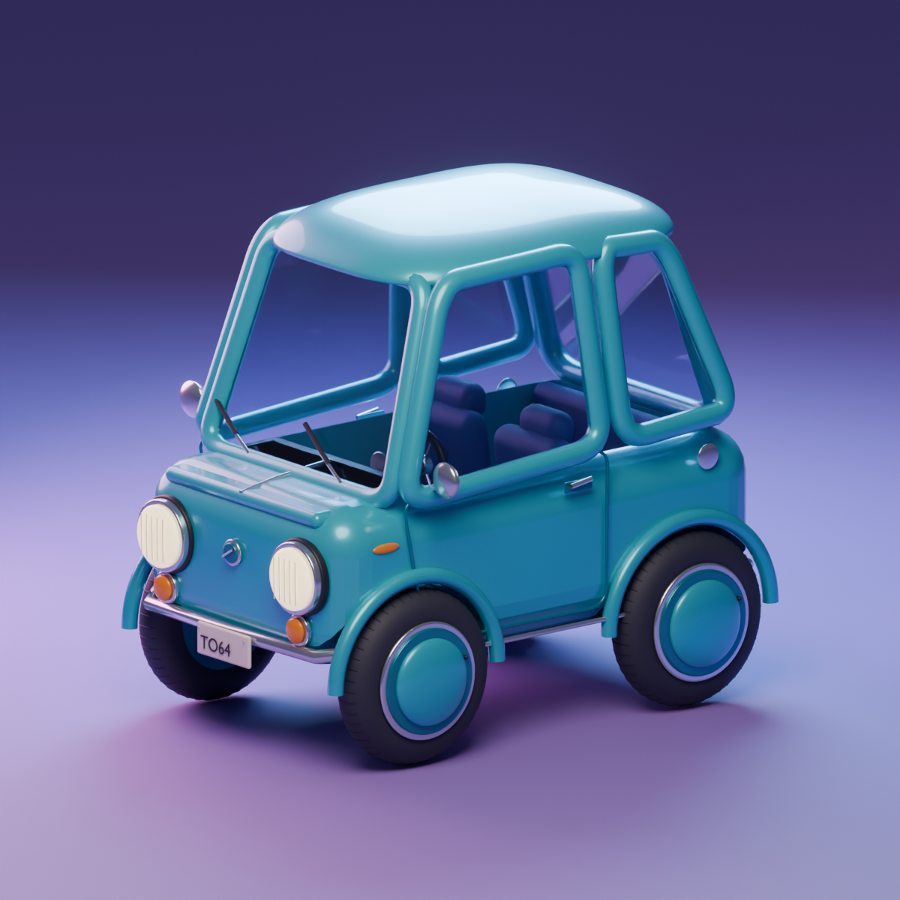

# Turquoise Microcar

Microauto estilizado inspirado en la referencia del estudio. Modelado con carrocería curva, aberturas reales para las ruedas, techo abombado e interior visible.

- `Turquoise_Microcar.blend`: vehículo, materiales, referencia empacada y estudio de iluminación editables.
- `Turquoise_Microcar.glb`: exportación del vehículo, sin estudio ni cámaras.
- `Turquoise_Microcar.png`: render de tres cuartos.
- `build_microcar.py`: generador de Blender.
- `validation.json`: inventario de componentes y comprobación de coordenadas finitas.



## Detalle

Ventanas con espesor, juntas de goma y molduras cromadas; asientos con costuras y cinturones, banca trasera, volante, instrumentos y pedales; faros convexos con estrías, intermitentes, limpiaparabrisas, juntas del capó y puertas, manijas, espejos, válvulas de neumáticos y matrícula.

## Materiales y efectos

- Vidrio: transmisión física, IOR 1.45 y espesor de 12 mm en las unidades del modelo.
- Pintura: metalizado y capa de barniz con reflejos suaves.
- Faros: emisión cálida y bloom mediante `FOG_GLOW` en el compositor.
- Cromados: materiales metálicos con rugosidad baja.
- Estudio: luz cálida principal, relleno rosa y contraluz cian sobre suelo lavanda.

El bloom y la iluminación de estudio pertenecen a la escena Blender; el GLB incluye materiales del vehículo, y su apariencia depende del visor. Es un modelo visual sin rig ni simulación de conducción.

## Regenerar

Desde la raíz, con Blender 5.2:

```sh
blender --background --python projects/turquoise-microcar/build_microcar.py
```

El generador reemplaza los archivos del modelo y render de este directorio. La referencia local se empaca si está disponible, pero no es necesaria para construir la geometría.
